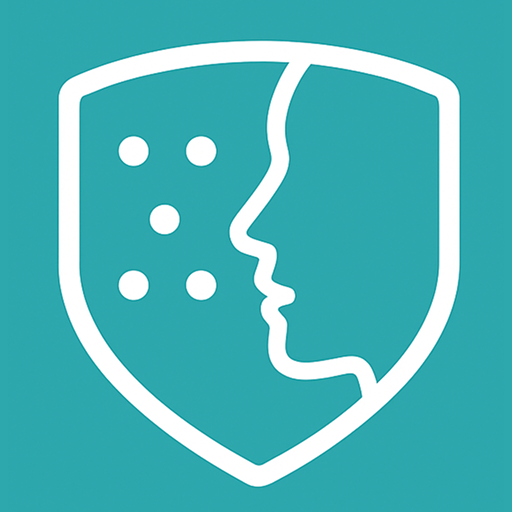

<div align="center">
   

# SkinSense AI 🔬

### AI-powered dermatological analysis for skin conditions

</div>

<div align="center">

[](https://flutter.dev/)
[](https://dart.dev/)
[](https://python.org/)
[](https://fastapi.tiangolo.com/)
[](https://azure.microsoft.com/)

</div>

## 📱 App Screenshots

<table>
  <tr>
    <td></td>
    <td></td>
    <td></td>
    <td></td>
  </tr>
  <tr>
    <td align="center"><b>Home Screen</b></td>
    <td align="center"><b>Analysis Results</b></td>
    <td align="center"><b>AI Chatbot</b></td>
    <td align="center"><b>PDF Report</b></td>
  </tr>
</table>

## 🌟 Features

- **Skin Image Analysis**: AI-powered analysis of skin conditions with confidence scores
- **AI Chatbot**: Interactive assistant for skin health questions and personalized advice
- **PDF Reports**: Professional medical-grade reports for sharing with healthcare providers
- **History Tracking**: Monitor skin condition changes over time
- **User-Friendly Interface**: Easy photo capture from camera or gallery
- **Easy Sharing**: Share analysis results and PDF reports via preferred apps

## 📁 Project Structure

```
lib/
├── models/
│   └── analysis_result.dart        # Data model for analysis results
├── pages/
│   ├── analysis_page.dart          # Display analysis results
│   ├── history_page.dart           # View history of analyses
│   └── home_page.dart              # Main app screen
├── services/
│   ├── chatbot_service.dart        # Handle AI chatbot interactions
│   ├── gemini_service.dart         # Integration with Google Gemini AI
│   ├── pdf_service.dart            # Generate PDF reports
│   └── skin_analysis_service.dart  # Process skin images and store results
├── widgets/
│   └── chatbot_widget.dart         # UI for chatbot interactions
├── image_upload.dart               # Helpers for camera and gallery uploads
├── main.dart                       # App entry point
└── theme.dart                      # App theming
```

## 🛠️ Tech Stack

- **Frontend**: Flutter 3.32.1
- **Fine-tuned Chatbot**: Google Gemini AI
- **AI/ML**: MobileNet V2 for image classification
- **Backend**: FastAPI for RESTful services
- **Model Deployment**: Azure WebApps

## 🚀 Getting Started

### Prerequisites

- Flutter SDK (3.32.1 or higher)
- Android Studio / VS Code
- Git

### Installation & Setup

1. **Clone the repository**

   ```bash
   git clone https://github.com/aayushpaigwar/skinsense_ai.git
   cd skin_sense_ai
   ```

2. **Set up environment variables**

   Create a `.env` file in the `assets/creds/` directory:

   ```env
   BASE_URL=your_api_base_url_here
   ```

3. **Install dependencies**

   ```bash
   flutter pub get
   ```

4. **Run the application**

   ```bash
   flutter run
   ```

## 📱 Usage

### Analyzing Skin Images

1. Tap "Take Photo" to use the camera
2. Tap "Upload Photo" to select from gallery
3. Review the analysis results and recommendations

### Using the AI Chatbot

1. Tap the "Ask AI" floating action button
2. Type your skin health questions
3. Review the AI's responses

### Accessing Analysis History

1. Tap the history icon in the top-right corner
2. View and filter past analyses
3. Select an analysis to view detailed results

### Generating Reports

1. From an analysis result page, tap "Export as PDF"
2. Review and share the PDF report with healthcare providers

## ⚠️ Important Medical Disclaimer

**This application is for educational and informational purposes only and should not be used as a substitute for professional medical advice, diagnosis, or treatment. Always consult with qualified healthcare providers for medical concerns.**

## 📝 License

This project is licensed under the MIT License.

---
